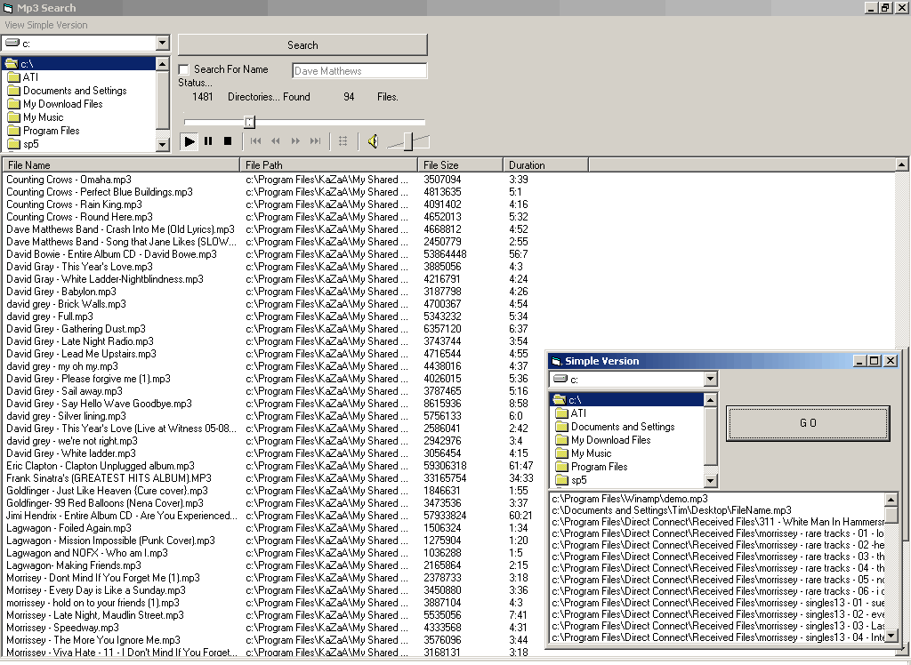



## Mp3 subdir Search w/path/duration/size

### Description

Well I Made this for myself as a quick search/player to get all the songs on my drive or in a folder's subdir's also i added a simple version that uses a listbox for beginers that dont know how to use a listview --- its pretty quick for me but for slow comps u might want to take off the duration check...
 
### More Info
 

             |
---                |---
**Submitted On**   |2002-01-20 02:15:58
**By**             |[Timothy Marin](https://github.com/Planet-Source-Code/PSCIndex/blob/master/ByAuthor/timothy-marin.md)
**Level**          |Intermediate
**User Rating**    |5.0 (10 globes from 2 users)
**Compatibility**  |VB 6\.0
**Category**       |[Sound/MP3](https://github.com/Planet-Source-Code/PSCIndex/blob/master/ByCategory/sound-mp3__1-45.md)
**World**          |[Visual Basic](https://github.com/Planet-Source-Code/PSCIndex/blob/master/ByWorld/visual-basic.md)
**Archive File**   |[Mp3\_subdir571752242002\.zip](https://github.com/Planet-Source-Code/timothy-marin-mp3-subdir-search-w-path-duration-size__1-32075/archive/master.zip)

